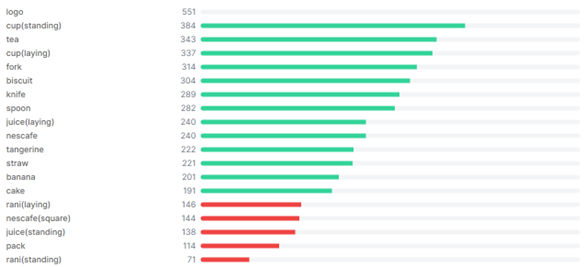
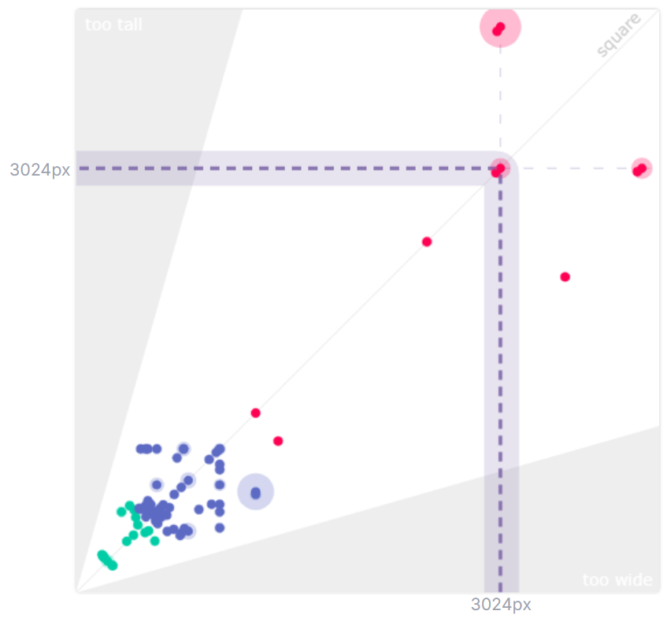
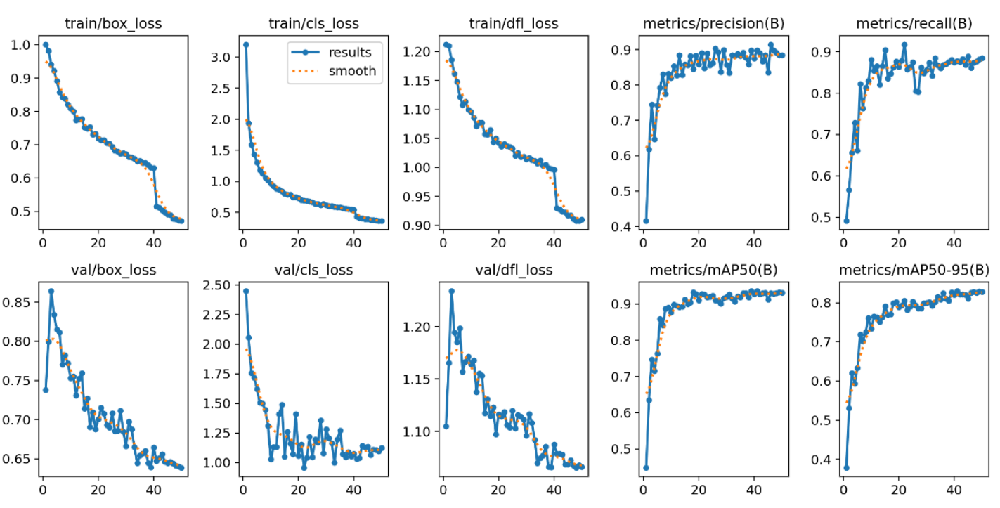
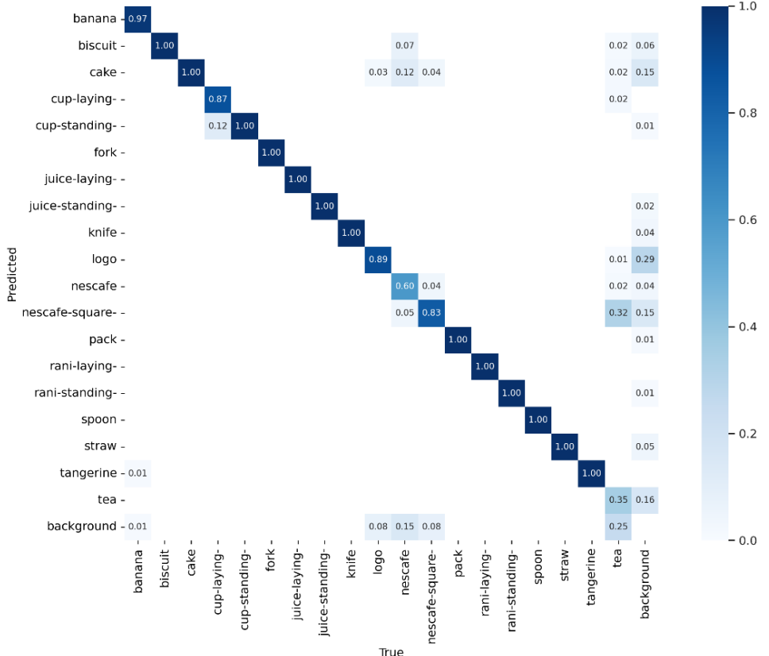
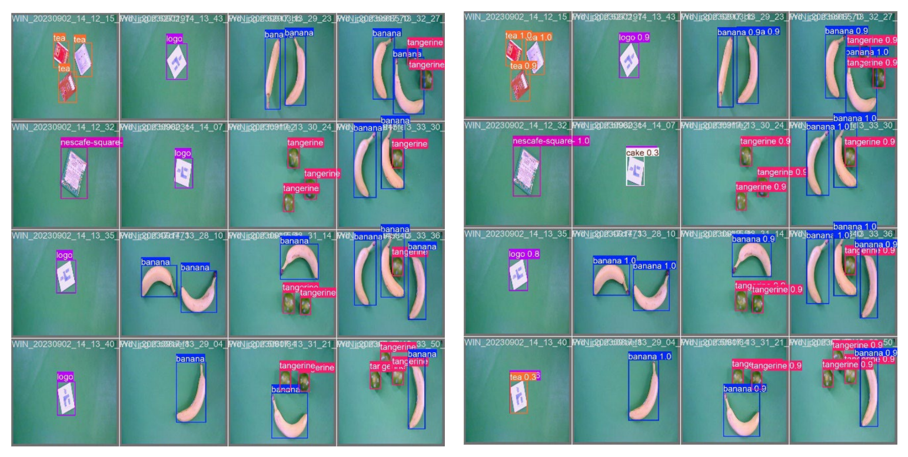
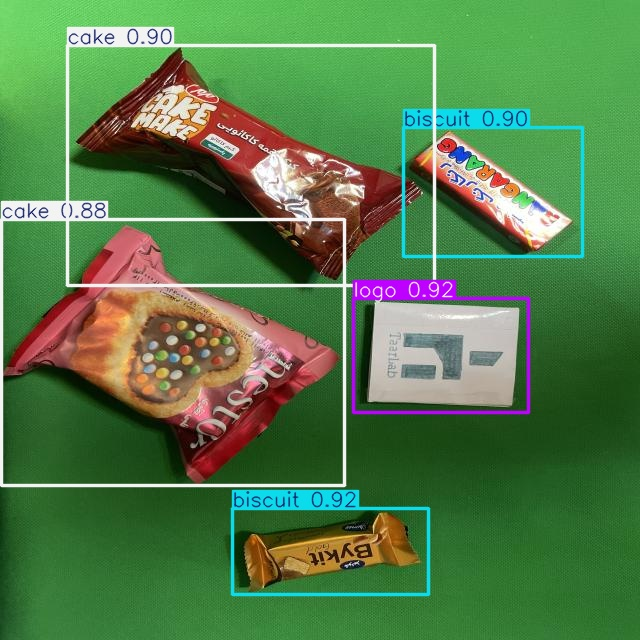
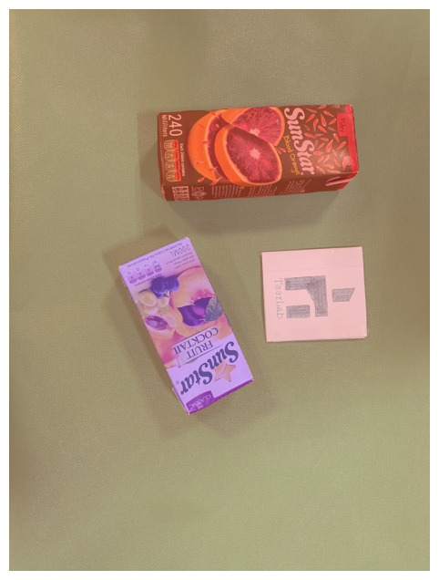
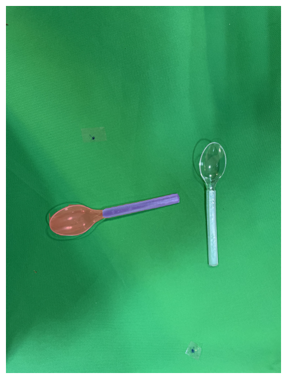
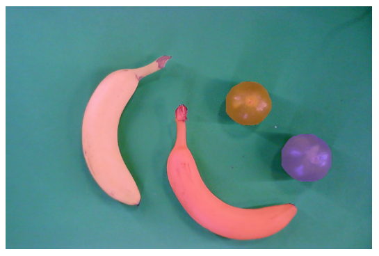
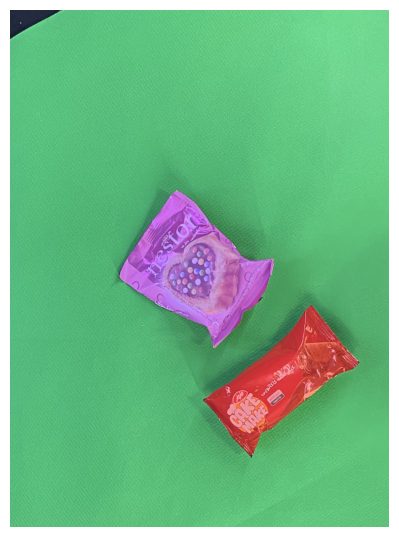

# Object Segmentation with YOLOv8 and SAM

This project focuses on detecting and segmenting objects in catering package images, including items like teabags, plastic cutlery, juice boxes, bananas, and more. Utilizing YOLOv8 for object detection and SAM (Segment Anything Model) for segmentation, the project demonstrates a streamlined approach to object recognition and segmentation to enhance robotic manipulation.

## Table of Contents
- [Overview](#overview)
- [Dataset](#dataset)
- [Methodology](#methodology)
  - [Object Detection with YOLOv8](#object-detection-with-yolov8)
  - [Object Segmentation with SAM](#object-segmentation-with-sam)
- [Results](#results)
  - [Object Detection](#object-detection-results)
  - [Object Segmentation](#object-segmentation-results)
- [Future Work](#future-work)

## Overview
In this project, we performed object detection on a custom dataset containing various catering items. The detection results were then used as box prompts for segmenting the objects with SAM. The project’s primary aim is to facilitate object recognition for potential robotic applications, including grasping and manipulation.

## Dataset
The [grasp-6](https://universe.roboflow.com/proj-sfl83/grasp-6) dataset contains images with various catering items such as:
- Teabags
- Plastic forks, knives, spoons and straws
- Juice boxes
- Bananas, biscuits, and other snack items

### Dataset Statistics
- Total Images: 1,408
- Training Set: 82%
- Validation Set: 7%
- Test Set: 12%

## Methodology

### Object Detection with YOLOv8
We fine-tuned YOLOv8 on the catering dataset to identify and locate objects with bounding boxes. YOLOv8's efficiency and accuracy make it suitable for real-time object detection tasks.

- **Model Configuration**: YOLOv8 with a custom dataset
- **Epochs**: 50
- **Performance**: Achieved a mAP@50 of 0.936 on the test set.

Normalized Confusion Matrix

#### Results
The object detection model showed high precision and recall values across most classes. Here’s a summary of some key metrics:
- **Precision**: 0.896
- **Recall**: 0.878
- **mAP@50-95**: 0.828

Results on Validation Dataset (Left: True, Right: Predicted)

### Object Segmentation with SAM

Using the bounding boxes obtained from YOLOv8 as box prompt, SAM was utilized for pixel-wise object segmentation. This approach provides a more detailed understanding of object shapes and boundaries.

Segmentation results were evaluated based on the accuracy of mask generation. The segmentation model performed well on well-represented classes but showed variation on under-represented classes.

## Future Work
- **Grasping Points Identification**: Implement algorithms to identify grasping points based on segmented objects.
- **Real-Time Integration**: Incorporate real-time detection and segmentation for robotic manipulation.

